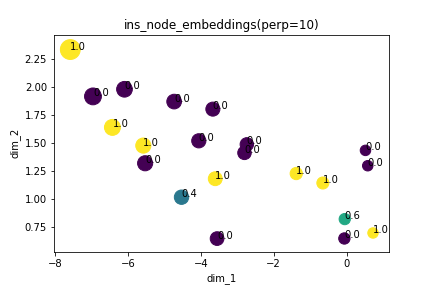

## Node embeddings visualization

#### Graph1: 21 nodes, 128 dim

#### Graph2: 21 nodes, 128 dim

**Observation**: Group of nodes are having similar representations, perhaps representations are not discriminat enough for the model to learn.

## Node embeddings with predicted scores

#### Graph4: 21 nodes, 128 dim

#### Graph5: 21 nodes, 128 dim

##### Color and size intensity is based on predicted score

# Latest Results:

## Node embeddings with true scores
#### Graph6: 21 nodes, 128 dim

## Node embeddings with predicted scores
#### Graph6: 21 nodes, 128 dim (regression)

## Node embeddings with true scores
#### Graph18: 21 nodes, 128 dim

## Node embeddings with predicted scores
#### Graph18: 21 nodes, 128 dim (regression)

## Node embeddings with true scores
#### Graph36: 21 nodes, 128 dim

## Node embeddings with predicted scores
#### Graph36: 21 nodes, 128 dim (regression)

## Node embeddings with true labels
#### Graph2: 21 nodes, 128 dim (classification)

## Node embeddings with true labels
#### Graph10: 21 nodes, 128 dim (classification)

